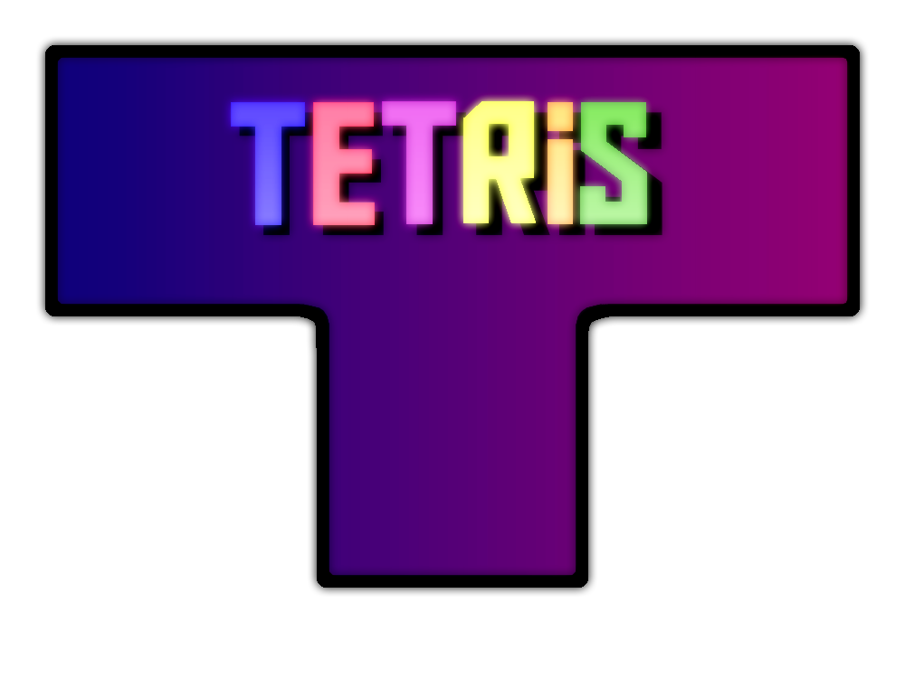

  

This is my implementation of the game Tetris using the Slick-2D and LWJGL libraries for graphics and the GSON library for saving and reading custom pieces.

<h2>Installation</h2>

 You can download it from  <a href="http://www.mediafire.com/file/zwp9i3jyn6pz07d/Tetris_Remake.rar/file">this link</a> or by downloading the repo and running the executable jar file in out/artifacts/TetrisRemake

<h2>Controls</h2>
<h3>Game</h3>

<b>S Key:</b> Moves piece down and makes sure that the piece timer for moving down is reset (Can be held down)

<b>D Key:</b> Moves piece right (Can be held down)

<b>A Key:</b> Moves piece left (Can be held down)

<b>W Key:</b> Rotates piece about its rotation point if exists

<b>Space Key:</b> Hard drops piece to end location

<b>E Key:</b> Puts piece into hold position. If the hold position is already filled swap the current piece and hold piece

<b>Escape Key:</b> Pause game

<h3>Piece Creator</h3>

 There are 3 different modes that change what happends when you click on a block in the grid. You can toggle through these modes with the E key.

<b> Mode 0:</b> Adds or removes a block from the grid

<b> Mode 1:</b> Adds, changes, or removes the rotation point from the grid

<b> Mode 2:</b> Changes the color of the block that will be added in mode 0 to the current clicked block

<h2>Credit</h2>

The background image was created by <a href = "https://pixabay.com/illustrations/color-triangle-geometric-textured-2174065/">Manuchi</a> and the fonts were created by <a href = "https://www.dafont.com/aldo-the-apache.font">AJ Paglia</a>, <a href = "https://www.dafont.com/squarefont.font">Bou Fonts</a>, and <a href= "https://www.dafont.com/forced-square.font">DrawPerfect</a>. 
